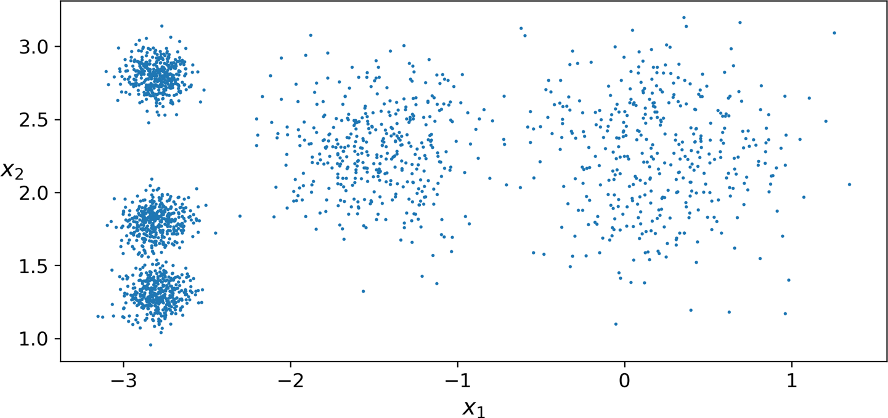

.. _clustering_algos:

=====================
Clustering Algorithms
=====================

Centroid
========

Be the first to `contribute! <https://github.com/bfortuner/ml-cheatsheet>`__

Density
=======

Be the first to `contribute! <https://github.com/bfortuner/ml-cheatsheet>`__

Distribution
============

Be the first to `contribute! <https://github.com/bfortuner/ml-cheatsheet>`__

Hierarchical
============

Be the first to `contribute! <https://github.com/bfortuner/ml-cheatsheet>`__

K-Means
========

K-means is a clustering algorithm which divides data into K clusters, where K is a positive integer greater than  or equal to 2. It is a useful unsupervised learning technique due to its speed and scalability.

.. rubric:: Algorithm Explained

The steps for the algorithm are as follows: 

1. Randomly initialize K centroids which represent the clusters you want to assign your data to. 

2. Find the Euclidean distance between all datapoints and every centroid. Assign datapoints to the cluster whose centroid is closest to that datapoint.

3. Shift the coordinates of the centroids to be the mean coordinates of all datapoints assigned to the centroid's cluster. 

4. If the distances between each of the old and new centroids is less than a specified value (a hyperparameter in the algorithm), or if you have iterated more than a specified number of times (also a hyperparameter) then training is complete. Otherwise, repeat from Step 2 onward.  

It is best to use K-means when data can be separated into spherical clusters as in the scatterplot below [#geron]_: 

.. rubric:: Code Implementation [#russano]_

.. code-block:: python
    
    class KMeans:
        def __init__(self,k):
            self.k = k

        def train(self,X,MAXITER = 1000, TOL = 1e-7):
            # Initial values for centroids
            centroids = np.random.rand(self.k,X.shape[1]) 
            centroidsold = centroids.copy()
            for iter_ in range(MAXITER):
                dist = np.linalg.norm(X - centroids[0,:],axis=1).reshape(-1,1)
                for class_ in range(1,self.k):
                    # Distance between datapoints and the rest of the centroids
                    # Axis = 1 is to specify do it for each row (i.e. sample)
                    dist = np.append(dist,np.linalg.norm(X - centroids[class_,:],axis=1).reshape(-1,1),axis=1)
                #What cluster should I assign datapoint to? I.E What cluster/class is the datapoint the closest to?
                classes = np.argmin(dist,axis=1)
                # update position
                for class_ in set(classes):
                    centroids[class_,:] = np.mean(X[classes == class_,:],axis=0)
                if np.linalg.norm(centroids - centroidsold) < TOL:
                    break
                    print('Centroid converged')
            self.centroids = centroids
        
        def predict(self,X):
            dist = np.linalg.norm(X - self.centroids[0,:],axis=1).reshape(-1,1)
            for class_ in range(1,self.k):
                dist = np.append(dist,np.linalg.norm(X - self.centroids[class_,:],axis=1).reshape(-1,1),axis=1)
            classes = np.argmin(dist,axis=1)
            return classes

Mean shift
==========

Be the first to `contribute! <https://github.com/bfortuner/ml-cheatsheet>`__

.. rubric:: References

.. [1] https://en.wikipedia.org/wiki/Cluster_analysis
.. [#geron] `Hands-On Machine Learning with Scikit-Learn, Keras, and TensorFlow, 2nd Edition <https://learning.oreilly.com/library/view/hands-on-machine-learning/9781492032632/ch09.html#idm45022159898696/>`__
.. [#russano] `KMeans Clustering in Python step by step <https://euanrussano.github.io/20190813kmeans/>`__

